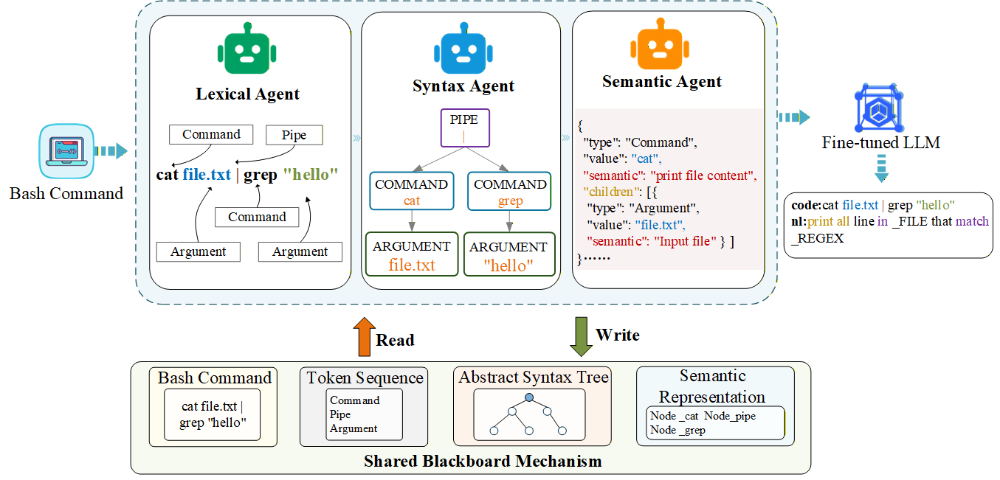

# MABash: Multi-Agent Collaborative Parsing for Bash Command Comment Generation

## 1. Overview

MABash is a multi-agent collaborative framework** for automatic Bash command comment generation.  
It decomposes command understanding into lexical, syntactic, and semantic parsing stages, coordinated through a shared blackboard architecture, and integrates a fine-tuned large language model for structure-aware comment generation.

  

## 2. Directory Introduction

- **dataset**: stores the original dataset as well as complexity-based splits for training, validation, and testing (Simple / Medium / Complex), used for model training and fine-grained evaluation.

- **finetuning**: contains all components related to large language model fine-tuning, including different backbone models (DeepSeek, LLaMA, Qwen), training processes, intermediate logs, and generated outputs.

- **output**: stores the final generated results and evaluation-related files, including model predictions, reference texts, and scripts for computing evaluation metrics.

- **src**: contains the core implementation, including the multi-agent parsing framework, fine-tuning pipeline, and inference/generation modules.

- **vllm**: contains inference and runtime logs based on the vLLM framework, used to accelerate model inference and record execution details.

## 3. Model Training Steps

i. Navigate to the folder `src`

ii. Run model fine-tuning `python finetuning.py`

iii. Perform model inference `python pred.py`

iv. Execute the multi-agent parsing framework `python agent.py`

## 4. Result Evaluation

i. Navigate to the folder `output`

ii. Run NLG-based evaluation metrics to assess the generated results `python nlg-eval.py`

iii. Run BLEU evaluation to assess the generated results `python bleu.py`
